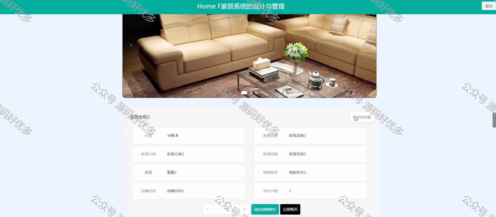

 
## 查看主页获取源码

> **作者介绍**： **✌**全网粉丝10W+本平台特邀作者、博客专家、CSDN新星计划导师、java领域优质创作者,博客之星、掘金/华为云/阿里云/InfoQ等平台优质作者、专注于毕业项目实战 **✌**

  

### 一、作品包含

源码+数据库+设计文档万字LW+PPT+全套环境和工具资源+部署教程

### 二、项目技术

前端技术：Html、Css、Js、Vue、Element-ui

数据库：MySQL

后端技术：Java、Spring Boot、MyBatis

  

### 三、运行环境

开发工具：IDEA/eclipse

数据库：MySQL5.7

数据库管理工具：Navicat10以上版本

环境配置软件： JDK1.8+Maven3.6.3

前端Nodejs：14

  

### 四、项目介绍
项目编号：springbootA068

该Home F家居系统采用B/S架构、前后端分离以及MVC模型进行设计，并采用Java语言以及 SpringBoot框架进行开发。本系统主要设计并完成了用户注册、登录，购买家具过程、个人信息修改等，商家添加家具信息、对家具进行发货，管理员对商家管理、用户管理、家具分类管理、家具管理、交流论坛、系统管理等功能，进行维护与管理。该系统操作简单，界面设计简单，不仅能基本满足目前网上商城的日常管理工作，而且能有效降低人员成本和时间成本，为网上商城工作提供方便。

### 五、运行截图

